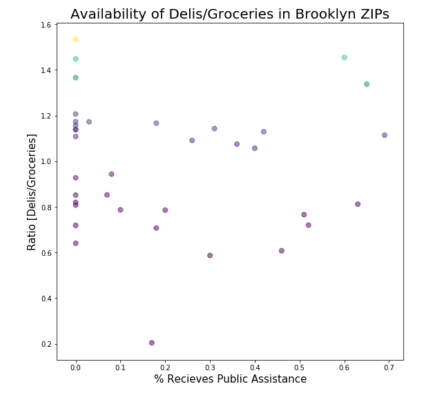
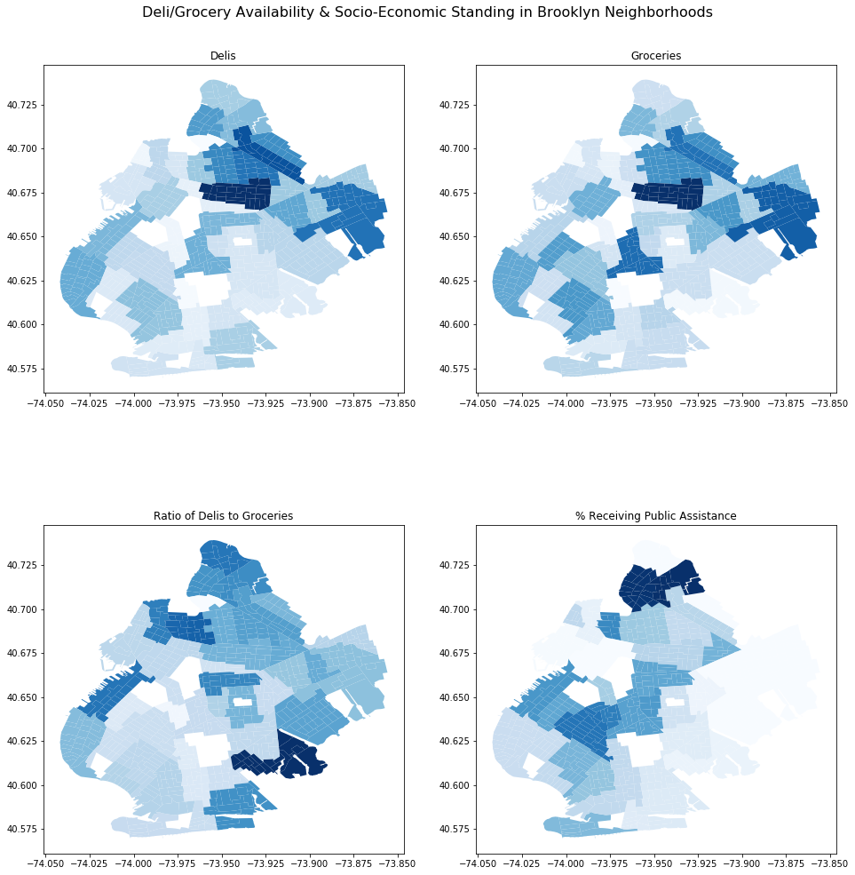

# PUI2018 - HOMEWORK 8 - ZEM232

# Part 1: Urban Data Visualization
Data acquisition, wrangling & visualization is produced in the notebook titled "HW8_zem232_Data_Visualization.ipynb" in this repo.

As a graduate student professional, I want to believe that my ritual egg & cheese sandwich is a perfectly healthy choice, especially if I politely ask for a thick wedge of iceberg lettuce and tomatoe slices in between the melted goo of cheddar and buttery toasted bialy. In reality, the quick deli sandwich represents most meals for many New Yorkers who are eating on-the-go between meetings, work, and karate class. 

Quite frankly, it's shocking how few of my friends, peers and neighbors cook home cooked meals in this city. I speculate this is due to sheer lack of time, cooking space, inspiration, or availability of affordable groceries. In my experience, it may be the former and the latter that are a real obstacle for most people. I believe that eating home cooked meals is key to eating healthy, however is a privelige for a lot us in the city. Given the health crisis that America is living in at the moment, urging more Americans to cook healthy meals at home with fresh produce can be very beneficial. I am lead to believe that in poor neighborhoods there are more delis and fast-food joints than there are grocery stores. I have also realized that as more a neighborhood becomes more affluent, many of the smaller grocers and green-delis drop off the map in place of larger grocery stores like Whole Foods or Harvest Market. I am curious to see what the spread is of delis and groceries across the city, and how socio-economic factors come into play. 

To investigate this further, I downloaded the dataset of registered businesses in New York City from the NYC Open Data portal. I isolated my search to Brooklyn since I am personally most familiar with this borough. 
Apparently the registered business "type" (denoted as Industry) in the dataset provides is more granular for certain industries (e.g. Laundries, Home Improvement Contractor), however apparently most grocery stores and delis are registered as Tobacco Retail Dealers. Therefore I isolated the Businesses with the words 'grocer', 'food', or 'produce' in the business name to represent the grocery stores, and isolated the Businesses with the words 'deli' or 'bodega' in the business name to represent delis. 

I then downloaded demographic data broken down by Zip Code, made available on NYC Open Data. 

### Delis and Groceries by Zip Code
The figure illustrates the spread of delis and groceries by Zip Code. Upon initial glance, there is no apparent "winner" in terms of which appears more. 

### Delis, Groceries, and Deli-Groceries by Zip Code
The figure illustrates the spread of delis, groceries and deli-groceries by Zip Code. Deli-groceries occupy a bit of a gray area, since the existence of green delis are very prevelant in certain neighborhoods. However, #upon personal experience#- not all of these so-called grocery-delis sell produce, and are merely a delis with a misleading name (selling a banana and apple DOES NOT give grocery cred!). For the purpose of this analysis, I am interested in the availability of fresh produce to cook a healthy meal. 

### Scatterplot of Deli/Grocery Ratio vs. the % of Population Receiving Public Assistance in Brooklyn Zip Codes
The plot aims to determine a correlation between the ratio of delis to grocery stores in neighborhoods in Brooklyn, based on the total percentage of people recieving public assistance. The scatterplot looks like a starry sky at best. This data would be more interesting to look at on a more granular basis, which can be achieved by looking at census tract or PUMA regions. 

### Visualizing Spread of Delis/Groceries and Socioeconomic Factors in Neighborhoods of Brooklyn

The corresponding names to each NTA code can be found on [NYC OPEN DATA](https://data.cityofnewyork.us/City-Government/Brooklyn/722p-gmmv).

# Part 2: Citibike Miniproject

For this mini-project, I will be looking into how age of riders impacts ridership patterns. 

## Citi Bikes IDEA: 
#### Younger people are more likely to use Citi Bike in the evenings.

## NULL HYPOTHESIS:
#### The daily proportion of young people (the younger half of the population) is the same or higher than the proportion of the older people (the older half of the population) biking in the evenings (after 7 pm).

#_$H_0$_ : $\frac{Y_{\mathrm{evening}}}{Y_{\mathrm{total}}} - \frac{O_{\mathrm{evening}}}{O_{\mathrm{total}}}>= 0 $
#_$H_1$_ : $\frac{Y_{\mathrm{evening}}}{Y_{\mathrm{total}}} - \frac{O_{\mathrm{evening}}}{O_{\mathrm{total}}} < 0$

#### Using a significance level  $\alpha=0.05$

#### By calculating the daily proportion for a single month, I obtained ~30 trials to test. Therefore, a t-test will suffice.

Data acquisition, wrangling, and analysis was produced according to the notebook "HW8_zem232_citibikes.ipynb" in this repo. 

The full report can be found in the following link on Authorea:
https://www.authorea.com/336225/a_aNTd0HVH37T3xnXzrs6w

